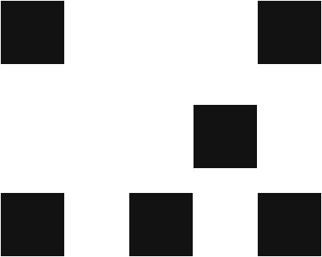
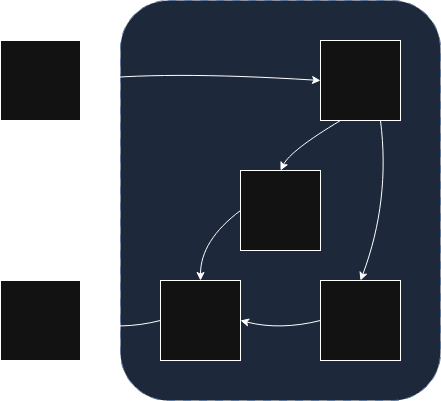
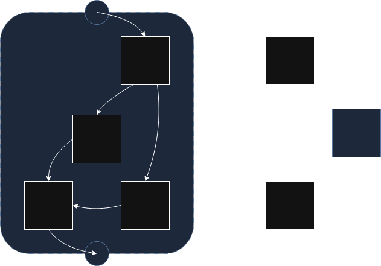
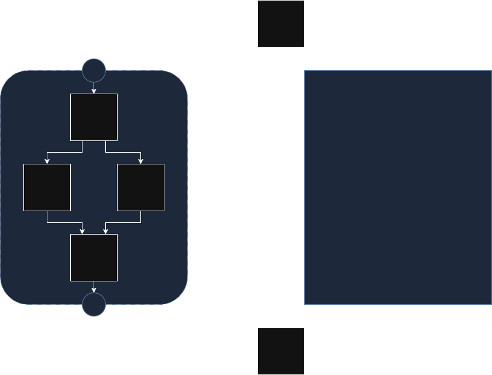
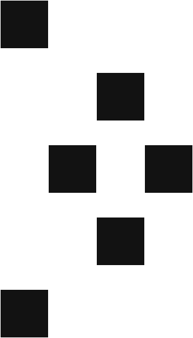

<p align="center">
<picture>
  <source media="(prefers-color-scheme: dark)" srcset="https://github.com/triskellib/triskel/blob/master/.github/assets/triskel_dark.png?raw=true">
  <source media="(prefers-color-scheme: light)" srcset="https://github.com/triskellib/triskel/blob/master/.github/assets/triskel_light.png?raw=true">
  
</picture>
</p>

<p align="center">
<a href="https://pypi.org/project/pytriskel/">
    
</a>

<a href="https://discord.gg/zgBb5VUKKS">
    
</a>
</p>


**Triskel** is a Control Flow Graph (CFG) layout engine. It provides you with
coordinates to draw CFGs in your reverse-engineering tools.

- CFG specific layout, emphasizing Single Entry Single Exit Regions
- Python bindings
- Export to PNG / SVG (with cairo)
- DearImgui integration
- LLVM integration


## Quick start

### Python

```
$ pip install pytriskel
```

```python
from pytriskel.pytriskel import *

builder = make_layout_builder()

# Build the graph
n1 = builder.make_node("Hello")
n2 = builder.make_node("World")
builder.make_edge(n1, n2)

# Measure node size using font size
png_renderer = make_png_renderer()
builder.measure_nodes(png_renderer)

# Export an image
layout = builder.build()
layout.save(png_renderer, "out.png")
```

### C++

```cpp
#include <triskel/triskel.hpp>

int main(void) {
    auto builder  = triskel::make_layout_builder();

    auto n1 = builder->make_node("Hello");
    auto n2 = builder->make_node("World");
    builder->make_edge(n1, n2)

    auto renderer = triskel::make_svg_renderer();
    builder->measure_nodes(renderer)
    auto layout   = builder->build();

    layout->render_and_save(*renderer, "./out.svg");

    return 1;
}
```

## Theory

Triskel is the implementation for the paper [Towards better CFG layouts](https://hal.science/hal-04996939).

The key idea behind Triskel is to split the CFG into Single Entry Single Exit regions.
We are then able to layout each region taking advantage of a divide and conquer approach.

## Walkthrough

Initially we have a directed graph



The first step involves identifying Single Entry Single Exit (SESE) regions. (See the implementation here: [sese.cpp](https://github.com/triskellib/triskel/blob/master/lib/src/analysis/sese.cpp))
In the diagram, the region is in blue. Notice how a single edge enters and exits the blue border.



We can then split each region out of the graph. At this step we have multiple smaller directed graphs.
Note that how in the graph of the SESE region, we had to add 2 virtual nodes to represent the entry and exit points.
In the other graph, we added an additional node to represent the region (still in blue).



The next step involves laying out each SESE region's graph using Sugiyama algorithm (See the implementation here: [sugiyama.cpp](https://github.com/triskellib/triskel/blob/master/lib/src/layout/sugiyama/sugiyama.cpp)).
Note how we have to layout the SESE region first in order to know the coordinates of the blue node.



Finally, we can superimpose the layouts to obtain the final layout.



## Compilation

Triskel relies on the following dependencies (the provided binaries also have their own dependencies)

- [fmt](https://github.com/fmtlib/fmt)

Triskel can then be compiled with cmake

```
$ git clone https://github.com/triskeles/triskel
$ cd triskel
$ cmake -B build
$ cmake --build build
```

You can then link to Triskel

```cmake
target_link_libraries(foo PRIVATE triskel)
```

### CMake options

To compile with all options and external dependencies check the [dockerfile](https://github.com/triskellib/triskel/tree/master/docker/fedora).

#### `ENABLE_LLVM`

Adds [LLVM](https://llvm.org/) integration.

This also adds `LLVM 19` as a dependency.

#### `ENABLE_IMGUI`

Adds [ImGui](https://github.com/ocornut/imgui) integration, used for making GUIs.

This adds the following dependencies:

- `imgui` (To use compile imgui with CMake you can use the code in [`docker/fedora/dependencies.sh`](https://github.com/triskellib/triskel/blob/master/docker/fedora/dependencies.sh))
- `glfw3`
- `OpenGL`
- `GLEW`
- `SDL2`
- `stb_image`

#### `ENABLE_CAIRO`

Adds [Cairo](https://www.cairographics.org/) integration, used for exporting images.

## Binaries

Triskel comes with many example binaries to help illustrate usage.

These binaries all require an additional dependency:

- [gflags](https://gflags.github.io/gflags/)

### [triskel-bench](https://github.com/triskellib/triskel/tree/master/bin/bench)

> Used for testing and evaluation.

This binary lays out each function in an LLVM module and outputs a CSV containing performance reviews.

It can also be used on a single function to analyze the lay out with `perf`.

#### Dependencies

This binary only requires `triskel` built with `ENABLE_LLVM=ON`.


<!-- The evaluation pipeline can be found at [triskel-eval](https://github.com/triskeles/triskel-eval). -->


###  [triskel-gui](https://github.com/triskellib/triskel/tree/master/bin/gui)

An example implementation of a GUI using Dear ImGui.

This application has a _very limited_ disassembler for x64 binaries.

#### Dependencies

This binary requires `triskel` built with `ENABLE_LLVM=ON` and `ENABLE_IMGUI=ON`.

It also needs [LIEF](https://lief.re/) and [Capstone](http://www.capstone-engine.org/) for the disassembler.

###  [triskel-img](https://github.com/triskellib/triskel/tree/master/bin/img)

A binary that generates images for CFGs using cairo.

#### Dependencies

This binary requires `triskel` built with `ENABLE_LLVM=ON` and `ENABLE_CAIRO=ON`.

It also requires [`capstone`](http://www.capstone-engine.org/) and [`LIEF`](https://lief.re/)

## Python bindings

You can download the python bindings using pip:

```
$ pip install pytriskel
```

## Contact
- Discord: [Triskel](https://discord.gg/zgBb5VUKKS)

## Cite Triskel
```bibtex
@inproceedings{royer:hal-04996939,
  AUTHOR = {Royer, Jack and Tronel, Fr{\'e}d{\'e}ric and Vin{\c c}ont, Ya{\"e}lle},
  TITLE = {{Towards Better CFG Layouts}},
  BOOKTITLE = {{Workshop on Binary Analysis Research 2025}},
  ADDRESS = {San Diego (CA), United States},
  MONTH = Feb,
  YEAR = {2025},
  URL = {https://hal.science/hal-04996939},
  DOI = {10.14722/bar.2025.23011},
}
```

